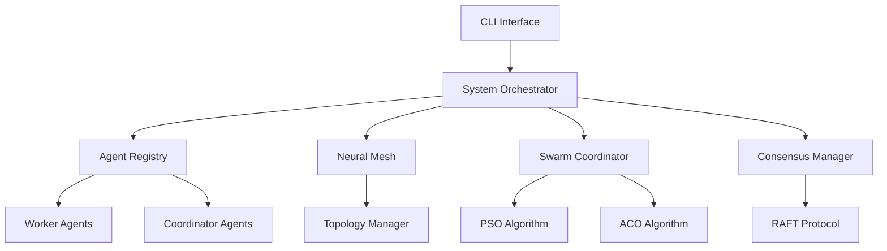
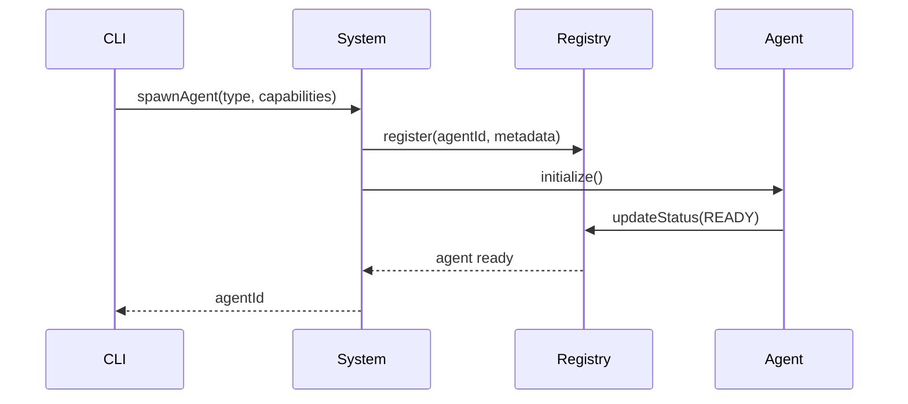

# Contributing to Codex-Synaptic

Thank you for your interest in contributing to Codex-Synaptic! This guide will help you get started with development, testing, and submitting contributions.

## Table of Contents

- [Code of Conduct](#code-of-conduct)
- [Getting Started](#getting-started)
- [Development Workflow](#development-workflow)
- [Code Standards](#code-standards)
- [Testing Guidelines](#testing-guidelines)
- [Commit Conventions](#commit-conventions)
- [Pull Request Process](#pull-request-process)
- [Architecture Overview](#architecture-overview)

## Code of Conduct

This project follows a professional, welcoming code of conduct. Be respectful, constructive, and collaborative.

## Getting Started

### Prerequisites

- Node.js >= 18.x
- npm >= 9.x
- TypeScript 5.x
- Git

### Setup Development Environment

```bash
# Clone the repository
git clone https://github.com/clduab11/codex-synaptic.git
cd codex-synaptic

# Install dependencies
npm install

# Link CLI globally for testing
npm link

# Build the project
npm run build

# Run tests
npm test
```

### Project Structure

```
codex-synaptic/
├── src/
│   ├── agents/          # Agent implementations (workers, coordinators)
│   ├── cli/             # Command-line interface
│   │   ├── commands/    # Individual CLI commands
│   │   └── utils/       # CLI utilities
│   ├── core/            # Core system components
│   │   ├── system.ts    # Main orchestrator
│   │   ├── logger.ts    # Logging system
│   │   ├── errors.ts    # Error handling
│   │   └── types.ts     # Core type definitions
│   ├── consensus/       # Consensus mechanisms (RAFT, Paxos)
│   ├── mesh/            # Neural mesh networking
│   ├── swarm/           # Swarm intelligence (PSO, ACO)
│   ├── reasoning/       # Reasoning strategies
│   ├── memory/          # Memory and persistence
│   ├── tools/           # Tool optimization
│   └── tests/           # Test suites
├── config/              # Configuration files
├── docs/                # Documentation
└── scripts/             # Build and utility scripts
```

## Development Workflow

### 1. Create a Feature Branch

```bash
git checkout -b feature/your-feature-name
# or
git checkout -b fix/bug-description
```

### 2. Make Changes

- Write clean, well-documented code
- Follow TypeScript best practices
- Add JSDoc comments for public APIs
- Keep functions small and focused (< 50 lines ideal)
- Maintain cyclomatic complexity < 10

### 3. Test Your Changes

```bash
# Run unit tests
npm test

# Run tests in watch mode
npm run test:watch

# Check test coverage
npm test -- --coverage

# Build to ensure no TypeScript errors
npm run build

# Lint your code
npm run lint

# Fix linting issues automatically
npm run lint:fix
```

### 4. Commit Your Changes

Follow conventional commit format:

```bash
git commit -m "feat: add new agent type for data processing"
git commit -m "fix: resolve consensus timeout issue"
git commit -m "docs: update README with new examples"
```

## Code Standards

### TypeScript Guidelines

1. **Type Safety**: Always use explicit types, avoid `any`

   ```typescript
   // ✅ Good
   function processTask(task: Task): TaskResult {
     // ...
   }

   // ❌ Bad
   function processTask(task: any): any {
     // ...
   }
   ```

2. **JSDoc Comments**: Document all public APIs

   ```typescript
   /**
    * Spawns a new agent with the specified type and capabilities
    * @param type - The agent type to spawn
    * @param capabilities - Array of capability names
    * @returns Promise resolving to the agent ID
    * @throws {AgentError} If agent spawn fails
    */
   async function spawnAgent(
     type: AgentType,
     capabilities: string[],
   ): Promise<AgentId> {
     // implementation
   }
   ```

3. **Error Handling**: Use custom error classes

   ```typescript
   import { AgentError, ErrorCode } from "../core/errors.js";

   throw new AgentError(
     ErrorCode.AGENT_NOT_FOUND,
     `Agent ${agentId} not found`,
     { agentId },
     true, // retryable
   );
   ```

4. **Async/Await**: Prefer async/await over raw promises

   ```typescript
   // ✅ Good
   async function fetchData(): Promise<Data> {
     const response = await api.get("/data");
     return response.data;
   }

   // ❌ Avoid
   function fetchData(): Promise<Data> {
     return api.get("/data").then((r) => r.data);
   }
   ```

### Code Organization

1. **File Size**: Keep files under 300 lines
2. **Function Size**: Keep functions under 50 lines
3. **Cyclomatic Complexity**: Keep complexity under 10
4. **Single Responsibility**: Each module should have one clear purpose

### Import Conventions

```typescript
// Use .js extensions for imports (required for ESM)
import { Logger } from "./logger.js";
import type { AgentType } from "./types.js";

// Group imports logically
// 1. External packages
// 2. Internal absolute imports
// 3. Internal relative imports
// 4. Type-only imports
```

## Testing Guidelines

### Test Structure

```typescript
import { describe, it, expect, beforeEach, afterEach } from "vitest";
import { CodexSynapticSystem } from "../core/system.js";

describe("CodexSynapticSystem", () => {
  let system: CodexSynapticSystem;

  beforeEach(() => {
    system = new CodexSynapticSystem({
      // test configuration
    });
  });

  afterEach(async () => {
    await system.shutdown();
  });

  it("should initialize successfully", async () => {
    await system.initialize();
    const status = system.getStatus();
    expect(status.initialized).toBe(true);
  });

  it("should spawn agents with correct types", async () => {
    await system.initialize();
    const agentId = await system.spawnAgent("code_worker", []);
    expect(agentId.type).toBe("code_worker");
  });
});
```

### Coverage Requirements

- **Minimum**: 80% statement coverage
- **Target**: 90%+ coverage for core modules
- Test both success and error paths
- Include edge cases and boundary conditions

### E2E Testing

```typescript
describe("Distributed Workflow E2E", () => {
  it("should complete multi-agent task coordination", async () => {
    // Setup
    const system = await bootSystem();

    // Execute workflow
    const result = await system.executeWorkflow({
      stages: [
        { type: "research", agent: "research_worker" },
        { type: "code", agent: "code_worker" },
        { type: "review", agent: "review_worker" },
      ],
    });

    // Verify
    expect(result.status).toBe("completed");
    expect(result.stages).toHaveLength(3);

    // Cleanup
    await system.shutdown();
  });
});
```

## Commit Conventions

We follow [Conventional Commits](https://www.conventionalcommits.org/):

### Types

- `feat`: New feature
- `fix`: Bug fix
- `docs`: Documentation changes
- `style`: Code style changes (formatting, no logic changes)
- `refactor`: Code refactoring
- `perf`: Performance improvements
- `test`: Adding or updating tests
- `chore`: Build process, dependencies, or tooling changes
- `ci`: CI/CD configuration changes

### Examples

```bash
feat: add support for Claude 3.5 Sonnet model
feat(swarm): implement Ant Colony Optimization algorithm
fix(consensus): resolve RAFT leader election timeout
fix: prevent memory leak in agent cleanup
docs: add Mermaid architecture diagrams to README
docs(api): document OpenAI integration endpoints
refactor(cli): extract utility functions to separate modules
test(agents): add E2E tests for multi-agent workflows
chore: upgrade TypeScript to 5.3
ci: add GitHub Actions workflow for automated testing
```

### Breaking Changes

```bash
feat!: change agent spawn API signature

BREAKING CHANGE: spawnAgent() now requires explicit capabilities array
```

## Pull Request Process

### Before Submitting

1. ✅ All tests pass (`npm test`)
2. ✅ Code builds without errors (`npm run build`)
3. ✅ Linting passes (`npm run lint`)
4. ✅ Coverage meets requirements (80%+)
5. ✅ Documentation updated
6. ✅ CHANGELOG.md updated (if applicable)

### PR Template

```markdown
## Description

Brief description of changes

## Type of Change

- [ ] Bug fix (non-breaking)
- [ ] New feature (non-breaking)
- [ ] Breaking change
- [ ] Documentation update

## Testing

- [ ] Unit tests added/updated
- [ ] E2E tests added/updated
- [ ] Manual testing completed

## Checklist

- [ ] Code follows project style guidelines
- [ ] Self-review completed
- [ ] Comments added for complex logic
- [ ] Documentation updated
- [ ] No new warnings introduced
- [ ] Tests pass locally
- [ ] Dependent changes merged
```

### Review Process

1. Automated checks must pass (CI/CD)
2. At least one maintainer approval required
3. All review comments addressed
4. Conflicts resolved with main branch

## Architecture Overview

### System Components



### Agent Lifecycle



## Getting Help

- 📖 Read the [docs](./docs/)
- 💬 Ask questions in [GitHub Discussions](https://github.com/clduab11/codex-synaptic/discussions)
- 🐛 Report bugs in [GitHub Issues](https://github.com/clduab11/codex-synaptic/issues)
- 📧 Email: info@parallaxanalytics.io

## License

By contributing, you agree that your contributions will be licensed under the MIT License.

---

**Thank you for contributing to Codex-Synaptic!** 🧠⚡
