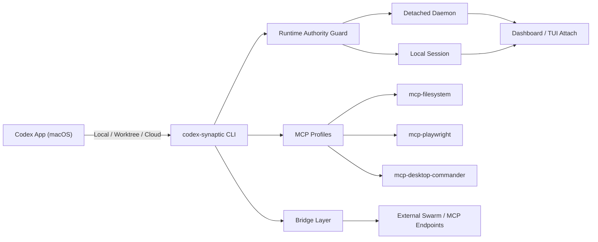
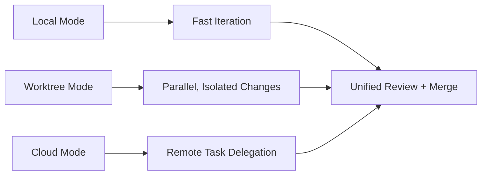

# codex-synaptic

[](https://github.com/clduab11/codex-synaptic/stargazers)
[](https://github.com/clduab11/codex-synaptic/network/members)
[](https://github.com/clduab11/codex-synaptic/issues)
[](https://github.com/clduab11/codex-synaptic/pulls)
[](https://github.com/clduab11/codex-synaptic/commits/main)
[](https://www.gnu.org/licenses/agpl-3.0.en.html)
[](https://nodejs.org/)
[](https://www.typescriptlang.org/)

Operator-grade orchestration for Codex workflows: daemon-backed runtime control, live terminal dashboards, and MCP-driven external bridges.

## Why This Release

Codex for macOS is now the default frontend path for this repo's operator workflow. This release tightens the "app + CLI + MCP" loop so teams can run Codex-Synaptic predictably in Local, Worktree, and Cloud-aligned flows.

### Verified alignment with official OpenAI docs (February 2026)

- Codex app setup is macOS (Apple Silicon) and recommended for mac users.
- App feature model includes Local / Worktree / Cloud modes, built-in Git, integrated terminal, automations, and MCP support.
- Codex CLI supports interactive mode, `resume`, `cloud`, `exec`, and `mcp` operations.
- Security defaults recommend workspace-write + on-request approvals for version-controlled repos.

Sources:
- [Codex Quickstart](https://developers.openai.com/codex/quickstart/)
- [Codex App](https://developers.openai.com/codex/app/)
- [Codex App Features](https://developers.openai.com/codex/app/features/)
- [Codex CLI Features](https://developers.openai.com/codex/cli/features/)
- [Codex Security](https://developers.openai.com/codex/security/)

## Star Chart

[](https://star-history.com/#clduab11/codex-synaptic&Date)

## System Flow



## Operator Command Deck

```bash
# build
npm install
npm run build

# readiness
node dist/cli/index.js launch --json
node dist/cli/index.js launch --strict --json
node dist/cli/index.js doctor
node dist/cli/index.js doctor --strict --json

# daemon lifecycle
node dist/cli/index.js background start
node dist/cli/index.js background status
node dist/cli/index.js background attach --watch --interval 2000
node dist/cli/index.js background logs --tail 100
node dist/cli/index.js background restart --timeout 10000
node dist/cli/index.js background stop --timeout 10000

# live dashboard
node dist/cli/index.js tui --attach-daemon --interval 1000
node dist/cli/index.js tui --local --interval 1000

# MCP profiles and registration
node dist/cli/index.js env plan mcp-filesystem mcp-playwright mcp-desktop-commander
node dist/cli/index.js env docker-login mcp-filesystem mcp-playwright mcp-desktop-commander
node dist/cli/index.js env up mcp-filesystem mcp-playwright mcp-desktop-commander
node dist/cli/index.js env status mcp-filesystem mcp-playwright mcp-desktop-commander
node dist/cli/index.js env codex-register mcp-filesystem mcp-playwright mcp-desktop-commander --replace
```

## Codex for macOS Workflow

```bash
# Local mode
codex -C /absolute/path/to/codex-synaptic

# first-launch gate in this repo
codex-synaptic launch --json

# Worktree mode
git worktree add ../codex-synaptic-worktree -b codex/macos-ops
codex -C ../codex-synaptic-worktree

# cloud task operations from CLI
codex cloud --help
```



## MCP Profiles Included

| Profile | Purpose | Safety posture |
| --- | --- | --- |
| `mcp-filesystem` | Repo/document access for Codex tasks | defaults to safe mode; controlled write can be explicitly enabled |
| `mcp-playwright` | Browser automation and verification | command-scoped runtime with health checks |
| `mcp-desktop-commander` | Desktop-level command bridge for external orchestration workflows | explicit profile startup + diagnostics before use |

## February 2026 Prompting Baseline

Use this structure for high-signal Codex tasks in this repo:

1. Mission: one objective.
2. Constraints: boundaries, safety controls, non-goals.
3. Acceptance criteria: objective pass/fail list.
4. Verification: exact commands and expected outcomes.
5. Deliverables: changed files, test evidence, residual risks.

## Security Posture (Codex-aligned)

Recommended defaults for version-controlled repos:

```bash
codex --sandbox workspace-write --ask-for-approval on-request
```

Use stricter read-only mode when auditing unfamiliar code:

```bash
codex --sandbox read-only --ask-for-approval on-request
```

## Docs Index

- [macOS integration workflow](docs/guides/codex-macos-workflows.md)
- [MCP setup and profile catalog](docs/mcp/README.md)
- [Autoscaler/daemon runbook](docs/runbooks/autoscaler-daemon-coordination.md)

## License

This project is licensed under **GNU Affero General Public License v3.0 (AGPL-3.0)**. See [LICENSE](LICENSE).
