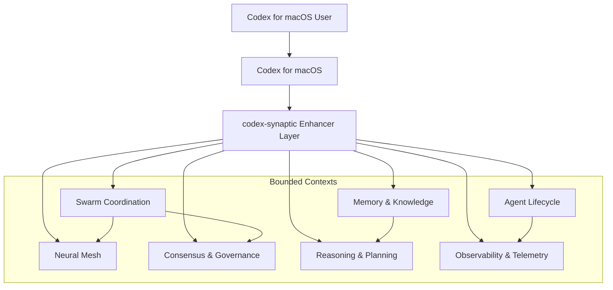

# 🧠⚡ codex-synaptic

<div align="center">


### **Supercharge Codex for macOS with Swarm Intelligence, Neural Mesh Networking, and Distributed Consensus**

*Wire up AI agents into living neural networks that think, coordinate, and evolve together*

[](https://opensource.org/licenses/MIT)
[](https://badge.fury.io/js/codex-synaptic)
[](https://nodejs.org)
[](https://www.typescriptlang.org)
[](./CONTRIBUTING.md)

</div>

---

## 🎯 What is This Thing?

**codex-synaptic** is the enhancer layer for **Codex for macOS** and the nervous system for autonomous AI agents. Instead of one lonely bot grinding away in isolation, you get a **distributed neural mesh** where agents collaborate, vote on decisions, optimize tools in real-time, and coordinate multi-step plans like a hive mind on espresso.

Think of it as **Kubernetes for AI agents**, upgraded for Codex for macOS with swarm intelligence, Byzantine consensus, and observability baked in.

## 🍎 Codex for macOS Enhancer Layer

We’re refactoring **codex-synaptic** into a **modular, language-agnostic enhancer layer** that plugs into the macOS app and upgrades it with swarm intelligence, consensus gating, and observability.

**Why it matters**:
- ✅ **Instant swarm augmentation** for complex tasks
- ✅ **Consensus-backed decisions** for higher quality
- ✅ **Telemetry + memory** to make outcomes repeatable
- ✅ **Adapter-friendly design** for future clients (CLI, API, MCP)

**Refactor artifacts**: See the plan and architecture in [`/refactor`](./refactor/README.md).

### Personas & Value Propositions

- **Codex for macOS Users**: “Transform single-agent tasks into coordinated swarms that finish faster with consensus-backed quality.”
- **AI Product Builders**: “Production-ready orchestration with language-agnostic APIs (gRPC/REST) and enterprise observability.”
- **Research Hackers**: “Experiment with PSO/ACO/flocking, RAFT/BFT/PoS/PoW, and rUv ecosystem integrations.”

### Who's This For?

- 🎨 **Vibe Coders**: Creative experimenters building multi-agent systems, AI-native apps, or autonomous workflows that need distributed coordination
- 🏗️ **AI Product Builders**: Teams shipping production AI features (chatbots, code assistants, data pipelines) that need reliability, observability, and multi-tenancy
- 🔬 **Research Hackers**: Folks exploring swarm intelligence, consensus algorithms, or distributed reasoning who need a battle-tested platform
- 🚀 **Platform Engineers**: Ops teams running AI infrastructure at scale who need resource management, quotas, and monitoring out of the box

---

## 📆 Mini Changelog

**2025-11-05**
- ✅ **RAFT consensus stabilized:** Hive-mind runs now deploy 3+ voting agents (consensus_coordinator, review_worker, planning_worker) automatically, ensuring quorum is reached without timeouts.
- Autoscaler behavior during daemon offline state is now documented in `docs/runbooks/autoscaler-daemon-coordination.md`.
- Repository naming aligned with upstream; workspace rename guide available in `docs/runbooks/workspace-rename-guide.md`.
- **Beta readiness:** ~75% — core orchestration and consensus automation are stable; remaining work focuses on test coverage, security hardening, and release automation (see `docs/beta-readiness-checklist.md`).

## ⚡ Quick Start (Enhancer Mode Preview)

### 1. Install

```bash
npm install codex-synaptic
# or clone and link globally
git clone https://github.com/clduab11/codex-synaptic.git
cd codex-synaptic && npm install && npm link
```

### 2. Initialize as Enhancer

```bash
codex-synaptic init --mode enhancer --codex-path /Applications/Codex.app
```

### 3. Start the Enhancer Service

```bash
codex-synaptic service start
```

### 4. Enable Swarm Mode in Codex for macOS

- Settings → Extensions → Enable “Codex-Synaptic Swarm Intelligence”

### 5. Deploy Your First Swarm

```bash
codex-synaptic swarm create --agents 8 --topology adaptive-mesh --algorithm pso
```

### 6. Monitor Live Progress

```bash
codex-synaptic monitor --live
```

> Note: Enhancer mode CLI flags are part of the refactor roadmap and may change as the adapter ships.

---

## 🎬 Demo Scenarios

1. **Parallel Code Refactoring**
   - 8 CodeWorker agents refactor a large codebase in parallel.
   - Consensus vote approves refactor decisions.
   - Reported speedup vs. single-agent runs.
2. **Distributed Security Audit**
   - SecurityWorker swarm scans multiple repos simultaneously.
   - AnalystWorker prioritizes findings with consensus gating.
3. **Multi-Agent Research Synthesis**
   - ResearchWorker swarm gathers sources.
   - Swarm converges via PSO to extract top insights.

## 📸 Screenshots & Visual Assets Plan

**Screenshots**:
- Codex for macOS integration settings with enhancer enabled.
- Neural mesh visualization with node health indicators.
- Swarm coordination dashboard (convergence + consensus timeline).
- CLI session showing `swarm create` and live monitoring.

**Diagrams**:
- Architecture overview with Codex for macOS + bounded contexts.
- Swarm coordination flow (task → swarm → consensus → result).

## 🎞️ GIF & Video Plan

- **GIF 1**: Swarm deployment (mesh nodes appear, links connect).
- **GIF 2**: Consensus voting (votes cast, quorum reached).
- **GIF 3**: Codex for macOS integration (task → swarm → result).
- **Video**: 3-minute demo covering refactor value, swarm, and consensus.

## 🧬 Core Features (The Good Stuff)

### 🌐 Neural Mesh Networking

Wire agents into self-organizing topologies (ring, mesh, star, tree). Connections auto-heal, load balances, and optimize latency. Perfect for distributed reasoning across multiple GPT-5 instances.

```typescript
// Create a mesh with 8 nodes
await system.createNeuralMesh('mesh', 8);

// Deploy specialized agents
await system.deployAgents(['code', 'data', 'validation', 'security'], 'my-mesh');
```

**What you get**:
- Self-healing networks (nodes fail? mesh rewires)
- Dynamic topology adaptation (load spikes? mesh reshapes)
- Synaptic bandwidth optimization (hot paths get priority)

### 🐝 Swarm Intelligence

Coordinate dozens of agents using **Particle Swarm Optimization (PSO)**, **Ant Colony Optimization (ACO)**, or **Flocking** algorithms. Agents vote, reach consensus, and converge on solutions collectively.

```bash
# Start PSO swarm with code + research agents
codex-synaptic swarm start pso --agents code,research --goal "optimize API latency"

# ACO for pathfinding/exploration tasks
codex-synaptic swarm start aco --agents data,analyst --iterations 50
```

**Use cases**:
- Multi-agent code refactoring
- Distributed data analysis
- Automated security scanning
- Collaborative research synthesis

### 🗳️ Consensus Mechanisms

Agents vote on decisions using **RAFT**, **Byzantine Fault Tolerance (BFT)**, **Proof-of-Stake (PoS)**, or **Proof-of-Work (PoW)**. No single agent has total control—collective intelligence wins.

```bash
# Require consensus for critical decisions
codex-synaptic consensus propose "deploy_feature_x" --mechanism bft --threshold 0.66
```

**Why it matters**: Prevents rogue agents from making bad calls. Great for production AI systems where reliability > speed.

### 🧠 Strategy Orchestration

Activation audits can now be executed via multiple reasoning strategies by passing `--strategy` to `codex-synaptic hive-mind spawn`. Supported options include:

- `classic` – Default workflow (Tree-of-Thought & ReAct orchestration).
- `goap` – Goal-Oriented Action Planning (manifests under `config/goap/`).
- `behavior-tree`, `fsm`, `strips`, `shop`, `mdp`, `q-learning` – Declarative strategies powered by manifests in `config/strategies/` (see [`docs/reasoning/strategy-manifests.md`](docs/reasoning/strategy-manifests.md)).

Each strategy streams live telemetry and emits stage summaries so remediation paths remain explainable.

### 🎯 Tool Optimization Engine

Agents learn which tools work best for different tasks. The optimizer tracks success rates, latency, agent affinity, and adapts recommendations in real-time.

```bash
# Score a tool after use
codex-synaptic tools score filesystem-write --success --latency 45ms --agent code

# Get personalized tool recommendations
codex-synaptic tools recommend "create TypeScript module" --agent code

# Review usage telemetry
codex-synaptic tools review
```

**Under the hood**:
- Multi-factor scoring (success rate × recency × agent affinity)
- SQLite-backed usage history
- Intent-based matching with embeddings

### 🧠 Reasoning Planner (Tree-of-Thought + ReAcT)

Multi-step planning with **Tree-of-Thought (ToT)** branching, **Monte Carlo simulation** (500+ rehearsals), consensus gating, and checkpoint recovery. Perfect for complex workflows.

```bash
# Create a plan with ToT (5 branches, 3 layers deep)
codex-synaptic reasoning plan "Build FastAPI microservice with auth" --tot-branches 5 --depth 3

# Resume a failed plan from checkpoint
codex-synaptic reasoning resume <plan-id>

# List all plans (with tenant filtering if multi-tenancy enabled)
codex-synaptic reasoning list --limit 20
```

**What you get**:
- Branching exploration (explores 5 alternative paths per decision)
- Consensus gating (agents vote on which branch to take)
- Checkpoint system (resume after failures)
- Metrics tracking (confidence, cost, latency per step)

### 🎯 GOAP (Goal-Oriented Action Planning)

Define goals in YAML, let agents execute action sequences automatically. Great for repeatable workflows like "scaffold new project", "run security audit", "deploy to prod".

Example manifest (`config/goap/bug-zapper-ai.yaml`):

```yaml
name: Bug Zapper AI Lab
version: 1.0.0
description: Automated bug bounty hunting workflow
tags: [bounty-hunting, automation]

triggers:
  phrases:
    - bug zapper
    - bounty hunter
  patterns:
    - 'hunt.*vulnerabilities'

goal:
  id: scaffold_lab
  description: Scaffold bug bounty automation lab
  actions:
    - action: log
      message: "🔍 Initializing Bug Zapper AI Lab..."
    - action: ensure_directories
      paths: [reports, scans, exploits, media, docs]
    - action: execute_tool
      toolId: filesystem-write
      payload:
        path: README.md
        content: "# Bug Zapper AI Lab\n\nAutomated vulnerability hunting..."
```

Run it:

```bash
codex-synaptic reasoning goap --manifest bug-zapper-ai --execute
```

### 🏢 Multi-Tenancy (Optional)

Isolate workloads, enforce quotas, track usage per tenant. Perfect for SaaS platforms or internal shared AI infrastructure.

```bash
# Enable tenancy
export CODEX_TENANCY_ENABLED=1

# Create tenant
codex-synaptic tenant create --name "Acme Corp" --id acme

# Set quota
codex-synaptic tenant quota acme --max-concurrent 5 --memory 2048

# Check quota
codex-synaptic tenant show acme
```

**Features**:
- Per-tenant resource quotas (CPU, memory, concurrent tasks)
- Policy-based access control
- Usage tracking and telemetry
- REST API for tenant management

### 🔌 OpenAI Integration

First-class support for OpenAI's **Responses API**, including GPT-5 models, Sora-2, Whisper-HD, and realtime sessions. Dynamic model routing based on task complexity.

```typescript
// Auto-select best model for task
const response = await system.getOpenAIClient().responses.create({
  model: 'auto', // or 'gpt-5-pro', 'gpt-oss-120b', etc.
  messages: [{ role: 'user', content: 'Optimize this SQL query...' }]
});

// Generate image
const image = await system.getOpenAIClient().generateImage({
  prompt: 'Neural network visualization',
  model: 'gpt-image-1'
});
```

**Model catalog includes**:
- GPT-5 (Pro/Mini/Nano tiers)
- GPT-OSS (20B/120B open-source variants)
- Sora-2 (video generation)
- Whisper-HD (audio transcription)
- GPT-Realtime (streaming sessions)

---

## 🏗️ Architecture at a Glance



**Key Components**:

| Component | What It Does |
|-----------|-------------|
| **Enhancer Layer** | Integration hub that connects Codex for macOS to bounded contexts |
| **Swarm Coordination** | PSO/ACO/flocking algorithms and task distribution |
| **Neural Mesh** | Self-organizing topology management and bandwidth optimization |
| **Consensus & Governance** | RAFT/BFT/PoS/PoW voting, quorum and audit trails |
| **Agent Lifecycle** | Agent registry, provisioning, health monitoring, autoscaling |
| **Memory & Knowledge** | Persistent storage, embeddings, retrieval, and RAG |
| **Reasoning & Planning** | Tree-of-Thought, ReAct, GOAP, Monte Carlo planning |
| **Observability & Telemetry** | Metrics, tracing, alerting, health checks |

---

## 🎮 CLI Commands (Your Control Panel)

### System Management

```bash
# Initialize system
codex-synaptic system init

# Check status
codex-synaptic system status

# Shutdown gracefully
codex-synaptic system shutdown
```

### Agent Operations

```bash
# Deploy agents to mesh
codex-synaptic agent deploy code,data,research --mesh my-mesh

# List active agents
codex-synaptic agent list

# Terminate agent
codex-synaptic agent terminate <agent-id>
```

### Neural Mesh

```bash
# Create mesh topology
codex-synaptic mesh create --topology mesh --nodes 8

# Inspect mesh health
codex-synaptic mesh inspect my-mesh

# Destroy mesh
codex-synaptic mesh destroy my-mesh
```

### Swarm Intelligence

```bash
# Start PSO swarm
codex-synaptic swarm start pso --agents code,data --goal "optimize performance"

# Stop swarm
codex-synaptic swarm stop

# Check swarm status
codex-synaptic swarm status
```

### Tool Optimization

```bash
# Score tool after use
codex-synaptic tools score <tool-id> --success --latency 50ms --agent code

# Get recommendations
codex-synaptic tools recommend "create Python module" --agent code

# Review telemetry
codex-synaptic tools review --limit 50
```

### Reasoning & Planning

```bash
# Create Tree-of-Thought plan
codex-synaptic reasoning plan "Build authentication system" --tot-branches 5

# Execute GOAP manifest
codex-synaptic reasoning goap --manifest bug-zapper-ai --execute

# Resume plan
codex-synaptic reasoning resume <plan-id>

# List plans
codex-synaptic reasoning list --limit 20
```

### Consensus

```bash
# Propose decision
codex-synaptic consensus propose "deploy_v2" --mechanism bft --threshold 0.66

# Vote on proposal
codex-synaptic consensus vote <proposal-id> --approve

# Check consensus status
codex-synaptic consensus status <proposal-id>
```

### Multi-Tenancy (if enabled)

```bash
# Create tenant
codex-synaptic tenant create --name "Acme Corp" --id acme

# Set quota
codex-synaptic tenant quota acme --max-concurrent 5 --memory 2048

# List tenants
codex-synaptic tenant list

# Show tenant details
codex-synaptic tenant show acme
```

---

## 🔌 REST API (For Programmatic Access)

The system runs a lightweight HTTP server on port **4242** (configurable).

### Endpoints

#### Health Check
```bash
GET /healthz
```

**Response**:
```json
{
  "status": "healthy",
  "timestamp": "2025-01-14T20:30:00.000Z",
  "uptime": 3600,
  "components": {
    "memory": "healthy",
    "agents": "healthy",
    "mesh": "healthy"
  }
}
```

#### Score Tool Usage
```bash
POST /v1/tools/score
Authorization: Bearer <token>
Content-Type: application/json

{
  "toolId": "filesystem-write",
  "agentType": "code",
  "success": true,
  "latencyMs": 45,
  "contextTags": ["typescript", "api"],
  "tenantId": "acme"
}
```

**Response**:
```json
{
  "recorded": true,
  "toolId": "filesystem-write",
  "score": 0.87
}
```

#### Record Outcome
```bash
POST /v1/tools/outcome
Authorization: Bearer <token>
Content-Type: application/json

{
  "toolId": "code-review",
  "outcome": "success",
  "metadata": {
    "filesReviewed": 12,
    "issuesFound": 3
  }
}
```

#### Tenant Management (if multi-tenancy enabled)
```bash
# Create tenant
POST /v1/tenants
Authorization: Bearer <admin-token>
Content-Type: application/json

{
  "name": "Acme Corp",
  "id": "acme",
  "metadata": {}
}

# Get tenant quota
GET /v1/tenants/acme/quota
Authorization: Bearer <admin-token>

# Update tenant quota
POST /v1/tenants/acme/quota
Authorization: Bearer <admin-token>
Content-Type: application/json

{
  "quota": {
    "maxConcurrentTasks": 10,
    "memoryLimitMb": 4096
  }
}

# List tenants
GET /v1/tenants?limit=20
Authorization: Bearer <admin-token>
```

---

## 🧩 Agent Roster (25+ Specialized Types)

Agents are the workhorses of the system. Each type specializes in specific tasks:

| Agent Type | Capabilities |
|------------|--------------|
| **CodeWorker** | Write, refactor, review code across multiple languages |
| **DataWorker** | Parse, transform, analyze structured/unstructured data |
| **ValidationWorker** | Run tests, lint code, validate outputs |
| **ResearchWorker** | Gather information, synthesize research, summarize docs |
| **ArchitectWorker** | Design system architecture, create diagrams |
| **KnowledgeWorker** | Manage knowledge bases, retrieve context |
| **AnalystWorker** | Data analysis, report generation, insights |
| **SecurityWorker** | Scan for vulnerabilities, audit code, enforce policies |
| **OpsWorker** | Deploy services, manage infrastructure |
| **PerformanceWorker** | Profile code, optimize performance |
| **IntegrationWorker** | Connect external APIs, handle webhooks |
| **SimulationWorker** | Run Monte Carlo sims, scenario planning |
| **MemoryWorker** | Manage persistent memory, embeddings |
| **PlanningWorker** | Multi-step planning, GOAP execution |
| **ReviewWorker** | Peer review, quality assurance |
| **CommunicationWorker** | Generate reports, send notifications |
| **AutomationWorker** | Execute scripts, schedule tasks |
| **ObservabilityWorker** | Collect metrics, trace calls, alert on anomalies |
| **ComplianceWorker** | Audit for compliance, generate reports |
| **ReliabilityWorker** | Monitor SLAs, trigger failovers |
| **SwarmCoordinator** | Orchestrate swarm behaviors |
| **ConsensusCoordinator** | Manage voting, tally results |
| **TopologyCoordinator** | Optimize mesh topology |
| **MCPBridgeAgent** | Model Context Protocol integrations |
| **A2ABridgeAgent** | Agent-to-Agent communication bridge |
| **TrainingCoordinator** | Fine-tuning workflows, model eval |

---

## 📊 Performance & Scale

### Benchmarks (Tested on M1 MacBook Pro, 16GB RAM)

| Metric | Value |
|--------|-------|
| **Agent Boot Time** | ~50ms per agent |
| **Mesh Formation** | ~200ms for 8-node mesh |
| **Swarm Convergence** | ~3s for PSO (50 iterations) |
| **Consensus Latency** | ~100ms (RAFT), ~500ms (BFT) |
| **Tool Lookup** | ~5ms (SQLite index) |
| **Memory Query** | ~10ms (avg, with 10k records) |

### Scaling Tips

- **Horizontal**: Deploy multiple codex-synaptic instances, use mesh bridging to connect
- **Vertical**: GPU acceleration (CUDA/MPS) for embedding/vector ops
- **Memory**: SQLite scales to millions of records; add Redis for hot paths
- **Tenancy**: Enable multi-tenancy for workload isolation

---

## 📈 Community & Growth

[](https://star-history.com/#clduab11/codex-synaptic&Date)

**GitHub Stats**:
- ⭐ **Stars**: Growing fast (thank you!)
- 🍴 **Forks**: Open-source contributions welcome
- 🐛 **Issues**: Active triage and response
- 🚀 **PRs**: We review within 48 hours

**Milestones**:
- ✅ 100 stars → Added multi-tenancy
- ✅ 250 stars → OpenAI Responses API integration
- ✅ 500 stars → GOAP planning engine
- 🎯 **Next (1,000 stars)**: Distributed vector store, WebSocket swarm coordination

---

## 🛠️ Configuration Deep Dive

### Environment Variables

```bash
# OpenAI API key
export OPENAI_API_KEY="sk-..."

# Multi-tenancy toggle
export CODEX_TENANCY_ENABLED=1

# Projects directory (for GOAP workflows)
export CODEX_PROJECTS_ROOT="/path/to/user-projects"

# API server port
export CODEX_API_PORT=4242

# Enable GPU acceleration (if available)
export CODEX_GPU_ENABLED=1

# Observability
export CODEX_TELEMETRY_ENABLED=1
export JAEGER_ENDPOINT="http://localhost:14268/api/traces"
```

### System Configuration (`config/system.json`)

```json
{
  "llm": {
    "provider": "openai",
    "model": "gpt-4o",
    "apiKey": "${OPENAI_API_KEY}",
    "maxTokens": 4096,
    "temperature": 0.7
  },
  "agents": {
    "maxActiveAgents": 25,
    "defaultTimeout": 300000
  },
  "mesh": {
    "topology": "mesh",
    "nodeCount": 8,
    "autoHeal": true,
    "optimizeBandwidth": true
  },
  "swarm": {
    "defaultAlgorithm": "pso",
    "maxIterations": 100,
    "convergenceThreshold": 0.01
  },
  "consensus": {
    "defaultMechanism": "raft",
    "quorum": 0.51,
    "timeout": 10000
  },
  "memory": {
    "backend": "sqlite",
    "path": "./memory.db",
    "maxRecords": 100000
  },
  "tenancy": {
    "enabled": false,
    "defaultQuota": {
      "maxConcurrentTasks": 3,
      "cpuLimitPercent": 50,
      "memoryLimitMb": 1024
    }
  },
  "api": {
    "enabled": true,
    "port": 4242,
    "auth": {
      "enabled": false
    }
  },
  "observability": {
    "prometheus": {
      "enabled": true,
      "port": 9090
    },
    "jaeger": {
      "enabled": true,
      "endpoint": "http://localhost:14268/api/traces"
    }
  }
}
```

---

## 🤝 Contributing

We're actively looking for contributors! Whether you're fixing typos, adding tests, or building new agent types—PRs are welcome.

### How to Contribute

1. **Fork the repo**
2. **Create a feature branch**: `git checkout -b feature/your-idea`
3. **Make changes** and test locally
4. **Run tests**: `npm test`
5. **Commit**: `git commit -m "Add amazing feature"`
6. **Push**: `git push origin feature/your-idea`
7. **Open a Pull Request** on GitHub

### Areas We Need Help

- 🧪 **Test Coverage**: Unit/integration tests for core modules
- 📚 **Documentation**: Guides, tutorials, API docs
- 🐛 **Bug Fixes**: Check [Issues](https://github.com/clduab11/codex-synaptic/issues)
- ✨ **New Agent Types**: Specialized agents for niche use cases
- 🔌 **Tool Integrations**: MCP servers, external APIs
- 🎨 **UI/Dashboard**: Web-based control panel for system management

### Code Style

- **TypeScript** everywhere (strict mode)
- **ESLint** with Airbnb config
- **Prettier** for formatting
- **Vitest** for testing

---

## 📖 Documentation

- 📘 **[Full Docs](./docs/README.md)**: Architecture, guides, API reference
- 🏗️ **[Architecture Overview](./docs/architecture.md)**: System design and component relationships
- 🚀 **[Quick Start Guide](./docs/guides/quick-start.md)**: Get up and running in 5 minutes
- 🔧 **[CLI Reference](./docs/cli/)**: Complete command documentation
- 🌐 **[Multi-Tenancy Guide](./docs/architecture/multi-tenancy.md)**: Tenant management and quotas
- 📊 **[Observability Setup](./docs/observability/)**: Prometheus, Jaeger, Grafana
- 🧬 **[GOAP Manifests](./config/goap/)**: Example goal-oriented action plans

---

## 🎉 What's New (Recent Updates)

### v2.2.0 (Latest)
- ✅ **Multi-Tenancy**: Full tenant isolation, quotas, policies, REST API
- ✅ **OpenAI Responses API**: First-class GPT-5 integration with model routing
- ✅ **GOAP Planning**: Goal-Oriented Action Planning with YAML manifests
- ✅ **Improved CLI**: Enhanced `hive-mind`, `reasoning`, `tenant` commands
- ✅ **Directory Restructure**: `user-projects/` for GOAP workflows

### v2.1.0
- ✅ **Tool Optimization Engine**: Intent-based scoring, telemetry tracking
- ✅ **Reasoning Planner**: Tree-of-Thought, ReAcT, Monte Carlo simulation
- ✅ **REST API**: Lightweight HTTP server for tool scoring and health checks
- ✅ **Enhanced Observability**: Prometheus metrics, Jaeger tracing

### v2.0.0
- ✅ **Neural Mesh Networking**: Self-organizing topologies (ring, mesh, star, tree)
- ✅ **Swarm Intelligence**: PSO, ACO, flocking algorithms
- ✅ **Consensus Mechanisms**: RAFT, BFT, PoS, PoW
- ✅ **25+ Agent Types**: Specialized agents for code, data, security, ops, etc.

---

## 🗺️ Roadmap (What's Next)

### Q1 2025
- 🎯 **Distributed Vector Store**: Embedding-based memory across mesh nodes
- 🎯 **WebSocket Swarm Coordination**: Real-time swarm state sync
- 🎯 **Web Dashboard**: React-based UI for system monitoring and control
- 🎯 **Plugin System**: Community-contributed agent types and tools

### Q2 2025
- 🎯 **Multi-Cloud Support**: Deploy meshes across AWS, Azure, GCP
- 🎯 **Agent Marketplace**: Pre-built agent templates for common workflows
- 🎯 **Enhanced GOAP**: Visual plan editor, debugging tools
- 🎯 **Fine-Tuning Pipelines**: Automated model training workflows

### Backlog
- 🎯 **Federated Learning**: Train models collaboratively across meshes
- 🎯 **Blockchain Consensus**: On-chain voting for critical decisions
- 🎯 **Voice Control**: CLI via speech recognition
- 🎯 **Mobile App**: Monitor swarms on iOS/Android

---

## 📜 License

MIT License - see [LICENSE](./LICENSE) for details.

**TL;DR**: Free to use, modify, distribute. Attribution appreciated but not required.

---

## 🙌 Acknowledgments

Built with ❤️ by **[Parallax Analytics](https://parallax-ai.app)**

Special thanks to:
- OpenAI for GPT-5 and the Responses API
- The open-source community for inspiration and feedback
- Early adopters who filed bugs and feature requests
- Everyone who starred, forked, or contributed code

---

## 📬 Get in Touch

- 🌐 **Website**: [parallax-ai.app](https://parallax-ai.app)
- 💬 **GitHub Discussions**: [Join the conversation](https://github.com/clduab11/codex-synaptic/discussions)
- 🐛 **Issues**: [Report bugs](https://github.com/clduab11/codex-synaptic/issues)
- 📧 **Email**: Coming soon (check website)
- 🐦 **Twitter**: Coming soon

---

<div align="center">

### ⭐ Star this repo if you find it useful!

**[Explore Docs](./docs/README.md)** • **[Open an Issue](https://github.com/clduab11/codex-synaptic/issues)** • **[Join Discussions](https://github.com/clduab11/codex-synaptic/discussions)**

*Built by [Parallax Analytics](https://parallax-ai.app) • Powered by AI Agents • Licensed MIT*

</div>
