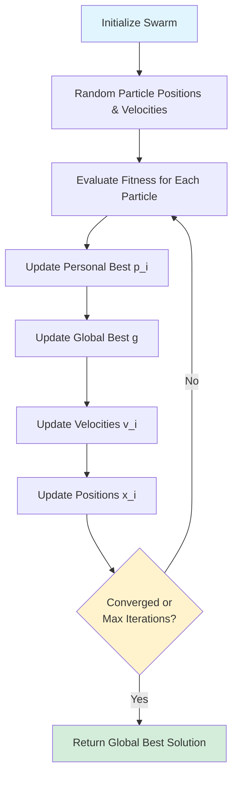
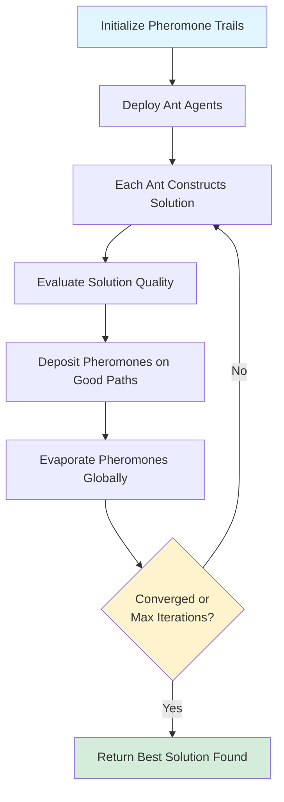

# Swarm Intelligence Algorithms in Codex-Synaptic

This document provides a comprehensive overview of the swarm intelligence algorithms implemented in Codex-Synaptic, including Particle Swarm Optimization (PSO) and Ant Colony Optimization (ACO).

## Table of Contents

- [Overview](#overview)
- [Particle Swarm Optimization (PSO)](#particle-swarm-optimization-pso)
- [Ant Colony Optimization (ACO)](#ant-colony-optimization-aco)
- [Implementation Details](#implementation-details)
- [Usage Examples](#usage-examples)
- [Performance Tuning](#performance-tuning)

## Overview

Swarm intelligence algorithms enable collective decision-making among autonomous agents. In Codex-Synaptic, these algorithms coordinate multiple AI agents to solve complex problems through emergent behavior.

### Why Swarm Intelligence?

- **Scalability**: Coordinate 5-500 agents simultaneously
- **Robustness**: System continues functioning even if individual agents fail
- **Emergence**: Complex solutions emerge from simple agent interactions
- **Adaptability**: Swarm adjusts to changing problem landscapes in real-time

### Supported Algorithms

1. **Particle Swarm Optimization (PSO)** - Inspired by bird flocking behavior
2. **Ant Colony Optimization (ACO)** - Inspired by ant foraging patterns
3. **Flocking** - Basic coordination based on Reynolds' boids model

## Particle Swarm Optimization (PSO)

### Algorithm Overview

PSO simulates the social behavior of bird flocking. Each agent (particle) moves through the solution space, influenced by:

- Its own best-known position (cognitive component)
- The swarm's global best position (social component)
- Its current velocity (inertia)

### Mathematical Model

Each particle `i` updates its position using:

```
v_i(t+1) = w * v_i(t) + c1 * r1 * (p_i - x_i(t)) + c2 * r2 * (g - x_i(t))
x_i(t+1) = x_i(t) + v_i(t+1)
```

Where:

- `v_i` = velocity of particle i
- `x_i` = position of particle i
- `p_i` = personal best position of particle i
- `g` = global best position (among all particles)
- `w` = inertia weight (typically 0.4-0.9)
- `c1` = cognitive coefficient (typically ~2.0)
- `c2` = social coefficient (typically ~2.0)
- `r1, r2` = random values in [0, 1]

### PSO Workflow



### PSO in Codex-Synaptic

Our implementation adds several enhancements:

1. **Adaptive Inertia Weight**: Dynamically adjusts `w` based on convergence rate
2. **Constraint Handling**: Respects agent resource limits and task constraints
3. **Multi-Objective**: Optimizes multiple objectives simultaneously (speed, quality, cost)
4. **Agent Specialization**: Different agent types contribute different expertise

### Configuration

```json
{
  "swarm": {
    "algorithm": "pso",
    "particleCount": 20,
    "maxIterations": 100,
    "inertiaWeight": 0.7,
    "cognitiveCoeff": 2.0,
    "socialCoeff": 2.0,
    "velocityClamp": 0.5
  }
}
```

### Use Cases

- **Code Optimization**: Multiple agents refactor code, converging on optimal solution
- **Architecture Design**: Agents explore design patterns, voting on best approach
- **Parameter Tuning**: Optimize hyperparameters for ML models
- **Resource Allocation**: Distribute workload across agents optimally

## Ant Colony Optimization (ACO)

### Algorithm Overview

ACO mimics how ants find optimal paths to food sources using pheromone trails. Agents deposit "pheromones" on promising solution paths, and subsequent agents favor these paths while still exploring alternatives.

### Mathematical Model

Probability of ant `k` choosing path from node `i` to node `j`:

```
P_ij^k = (τ_ij^α * η_ij^β) / Σ (τ_il^α * η_il^β)
```

Where:

- `τ_ij` = pheromone level on edge (i, j)
- `η_ij` = heuristic desirability of edge (i, j)
- `α` = pheromone influence parameter (typically ~1.0)
- `β` = heuristic influence parameter (typically ~2.0)

Pheromone update:

```
τ_ij(t+1) = (1 - ρ) * τ_ij(t) + Σ Δτ_ij^k
```

Where:

- `ρ` = evaporation rate (typically 0.1-0.3)
- `Δτ_ij^k` = pheromone deposited by ant k on edge (i, j)

### ACO Workflow



### ACO in Codex-Synaptic

Our ACO implementation includes:

1. **Max-Min Ant System (MMAS)**: Bounds pheromone values to prevent premature convergence
2. **Elitist Strategy**: Only best-performing ants deposit pheromones
3. **Local Search**: Agents perform local optimization on solutions
4. **Dynamic Evaporation**: Evaporation rate adapts based on diversity

### Configuration

```json
{
  "swarm": {
    "algorithm": "aco",
    "antCount": 30,
    "maxIterations": 150,
    "alpha": 1.0,
    "beta": 2.5,
    "evaporationRate": 0.2,
    "pheromoneMin": 0.01,
    "pheromoneMax": 10.0
  }
}
```

### Use Cases

- **Task Scheduling**: Find optimal execution order for dependent tasks
- **Workflow Optimization**: Discover efficient agent collaboration patterns
- **Knowledge Graph Traversal**: Navigate complex information spaces
- **Dependency Resolution**: Solve complex dependency trees

## Implementation Details

### File Locations

```
src/swarm/
├── coordinator.ts          # Main swarm orchestrator
├── pso/
│   ├── particle.ts         # PSO particle implementation
│   ├── swarm.ts            # PSO swarm logic
│   └── optimizer.ts        # PSO optimization engine
├── aco/
│   ├── ant.ts              # ACO ant agent
│   ├── colony.ts           # ACO colony management
│   ├── pheromone.ts        # Pheromone trail management
│   └── optimizer.ts        # ACO optimization engine
└── types.ts                # Shared type definitions
```

### Key Classes

#### SwarmCoordinator

Main entry point for swarm intelligence operations.

```typescript
class SwarmCoordinator {
  async startSwarm(config: SwarmConfiguration): Promise<string>;
  async stopSwarm(swarmId: string): Promise<void>;
  getSwarmStatus(swarmId: string): SwarmStatus;
  async optimizeObjective(objective: OptimizationObjective): Promise<Solution>;
}
```

#### PSOParticle

Represents a single particle in PSO.

```typescript
class PSOParticle {
  position: Vector;
  velocity: Vector;
  personalBest: Vector;
  personalBestFitness: number;

  updateVelocity(globalBest: Vector, config: PSOConfig): void;
  updatePosition(): void;
  evaluate(fitnessFunction: FitnessFunction): number;
}
```

#### ACOAnt

Represents a single ant in ACO.

```typescript
class ACOAnt {
  currentNode: string;
  visitedNodes: Set<string>;
  path: string[];
  pathCost: number;

  selectNextNode(
    pheromones: PheromoneMatrix,
    heuristic: HeuristicMatrix,
  ): string;
  constructSolution(graph: Graph): Solution;
  depositPheromones(pheromones: PheromoneMatrix): void;
}
```

## Usage Examples

### Example 1: PSO for Code Optimization

```typescript
import { SwarmCoordinator } from "./swarm/coordinator.js";

const coordinator = new SwarmCoordinator();

// Define optimization objective
const objective = {
  type: "code_optimization",
  target: "src/api/handlers.ts",
  metrics: ["performance", "maintainability", "testability"],
  constraints: {
    maxComplexity: 10,
    maxFileSize: 300,
  },
};

// Start PSO swarm
const swarmId = await coordinator.startSwarm({
  algorithm: "pso",
  particleCount: 15,
  maxIterations: 50,
  agents: ["code_worker", "review_worker", "performance_worker"],
  objective,
});

// Monitor progress
const status = coordinator.getSwarmStatus(swarmId);
console.log(`Best fitness: ${status.globalBest.fitness}`);
console.log(`Iterations: ${status.currentIteration}/${status.maxIterations}`);

// Get optimized solution
const solution = await coordinator.optimizeObjective(objective);
console.log("Optimized code:", solution.result);
```

### Example 2: ACO for Workflow Optimization

```typescript
import { SwarmCoordinator } from "./swarm/coordinator.js";

const coordinator = new SwarmCoordinator();

// Define workflow graph
const workflowGraph = {
  nodes: ["research", "design", "implement", "test", "deploy"],
  edges: [
    { from: "research", to: "design", cost: 2.0 },
    { from: "design", to: "implement", cost: 5.0 },
    { from: "implement", to: "test", cost: 3.0 },
    { from: "test", to: "deploy", cost: 2.0 },
  ],
};

// Start ACO colony
const colonyId = await coordinator.startSwarm({
  algorithm: "aco",
  antCount: 25,
  maxIterations: 100,
  objective: {
    type: "workflow_optimization",
    graph: workflowGraph,
    start: "research",
    goal: "deploy",
  },
});

// Get optimal workflow path
const solution = await coordinator.optimizeObjective(objective);
console.log("Optimal path:", solution.path);
console.log("Total cost:", solution.cost);
```

### Example 3: CLI Usage

```bash
# Start PSO swarm for code refactoring
codex-synaptic swarm start pso \
  --agents code,review,performance \
  --goal "optimize API handlers" \
  --particles 20 \
  --iterations 100

# Start ACO colony for task scheduling
codex-synaptic swarm start aco \
  --agents planning,coordination \
  --goal "optimize task schedule" \
  --ants 30 \
  --evaporation 0.2

# Check swarm status
codex-synaptic swarm status

# Stop swarm
codex-synaptic swarm stop
```

## Performance Tuning

### PSO Optimization

1. **Particle Count**:
   - Small problems (< 10 dimensions): 10-20 particles
   - Medium problems (10-50 dimensions): 20-50 particles
   - Large problems (> 50 dimensions): 50-100 particles

2. **Inertia Weight**:
   - Start high (0.9) for exploration
   - Decrease to low (0.4) for exploitation
   - Use linear or exponential decay

3. **Cognitive/Social Balance**:
   - High c1, low c2: More independent exploration
   - Low c1, high c2: More social convergence
   - Balanced (both ~2.0): Good general performance

### ACO Optimization

1. **Ant Count**:
   - Should be proportional to problem size
   - Typical range: 20-50 ants
   - More ants = better exploration, slower convergence

2. **Evaporation Rate**:
   - Low (0.1-0.2): Retains history, slower adaptation
   - High (0.5-0.7): Forgets quickly, faster adaptation
   - Tune based on problem dynamics

3. **Alpha/Beta Balance**:
   - High α: Trust pheromones (historical knowledge)
   - High β: Trust heuristics (greedy choices)
   - Start with α=1.0, β=2.5

### General Tips

- **Early Stopping**: Monitor convergence, stop if no improvement after N iterations
- **Diversity Maintenance**: Restart if swarm converges prematurely
- **Hybrid Approaches**: Combine PSO with local search for better results
- **Resource Management**: Limit concurrent agent count based on available resources

## References

### Academic Papers

1. Kennedy, J., & Eberhart, R. (1995). "Particle swarm optimization." IEEE International Conference on Neural Networks.
2. Dorigo, M., & Stützle, T. (2004). "Ant Colony Optimization." MIT Press.
3. Shi, Y., & Eberhart, R. (1998). "A modified particle swarm optimizer." IEEE Congress on Evolutionary Computation.

### Further Reading

- [PSO Tutorial](https://www.swarmintelligence.org/tutorials/pso)
- [ACO Handbook](https://www.aco-metaheuristic.org)
- [Swarm Intelligence Book](https://mitpress.mit.edu/books/swarm-intelligence)

---

**Last Updated**: 2025-11-16
**Author**: Parallax Analytics
**Contact**: info@parallaxanalytics.io
