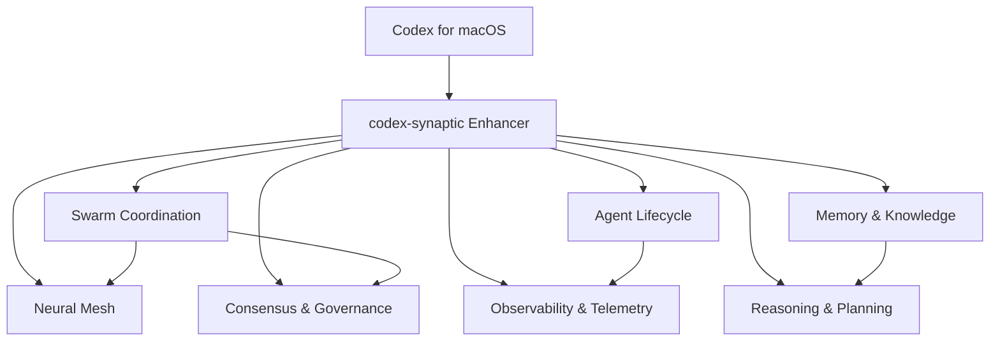

# Bounded Contexts

This document defines the language-agnostic bounded contexts for the enhancer refactor and maps current implementation areas to future interfaces.

## Core Contexts

### 1. Swarm Coordination Context
- **Responsibility**: Multi-agent orchestration, PSO/ACO/flocking algorithms, task distribution.
- **Current Implementation**: `src/swarm/`, `src/agents/swarm_coordinator.ts`.
- **Interface**: gRPC/Protocol Buffers.
- **Key Entities**: Swarm, SwarmAlgorithm, SwarmMetrics, ParticlePosition.
- **Integration Point**: Codex for macOS agent coordination layer.

### 2. Neural Mesh Context
- **Responsibility**: Network topology management, self-healing, bandwidth optimization.
- **Current Implementation**: `src/mesh/`, `src/agents/topology_coordinator.ts`.
- **Interface**: Graph API (REST or gRPC).
- **Key Entities**: MeshNode, MeshTopology, SynapticConnection, TopologyConstraint.
- **Integration Point**: Distributed agent networking for Codex for macOS.

### 3. Consensus & Governance Context
- **Responsibility**: RAFT/BFT/PoS/PoW voting, quorum management, decision auditing.
- **Current Implementation**: `src/consensus/`, `src/agents/consensus_coordinator.ts`.
- **Interface**: Consensus Protocol API (gRPC).
- **Key Entities**: Proposal, Vote, Quorum, ConsensusLog.
- **Integration Point**: Multi-agent decision-making for Codex for macOS.

### 4. Agent Lifecycle Context
- **Responsibility**: Agent deployment, health monitoring, resource management, autoscaling.
- **Current Implementation**: `src/agents/registry.ts`, `src/core/scheduler.ts`, `src/core/resources.ts`.
- **Interface**: Agent Management API (REST).
- **Key Entities**: Agent, AgentType, AgentCapability, ResourceQuota.
- **Integration Point**: Agent provisioning for Codex for macOS.

### 5. Memory & Knowledge Context
- **Responsibility**: Persistent storage, embeddings, knowledge retrieval, RAG.
- **Current Implementation**: `src/memory/memory-system.ts`.
- **Interface**: Knowledge API (REST/GraphQL).
- **Key Entities**: MemoryEntry, Embedding, KnowledgeGraph, Namespace.
- **Integration Point**: Shared knowledge base for Codex for macOS agents.

### 6. Reasoning & Planning Context
- **Responsibility**: Tree-of-Thought, ReAct, GOAP, Monte Carlo simulation.
- **Current Implementation**: `src/reasoning/`, `config/goap/`.
- **Interface**: Planning API (REST/gRPC).
- **Key Entities**: Plan, PlanStep, Goal, ActionManifest.
- **Integration Point**: Advanced planning for Codex for macOS.

### 7. Observability & Telemetry Context
- **Responsibility**: Metrics collection, tracing, alerting, health monitoring.
- **Current Implementation**: `src/core/health.ts`, `docs/observability/`.
- **Interface**: OpenTelemetry/Prometheus/Jaeger.
- **Key Entities**: Metric, Trace, Alert, HealthStatus.
- **Integration Point**: Unified observability for Codex for macOS + enhancer layer.

## Context Map



## Modular Repository Layout (Target)

```text
/packages
  /core
  /swarm-coordination
  /neural-mesh
  /consensus
  /agent-lifecycle
  /memory-knowledge
  /reasoning-planning
  /observability
  /integrations
    /codex-macos
    /openai
    /mcp
  /cli
```

## Migration Notes

- Introduce the `/packages` layout alongside existing `src/`.
- Bridge old CLI commands to new APIs via compatibility adapters.
- Move context by context to avoid cross-cutting regressions.
